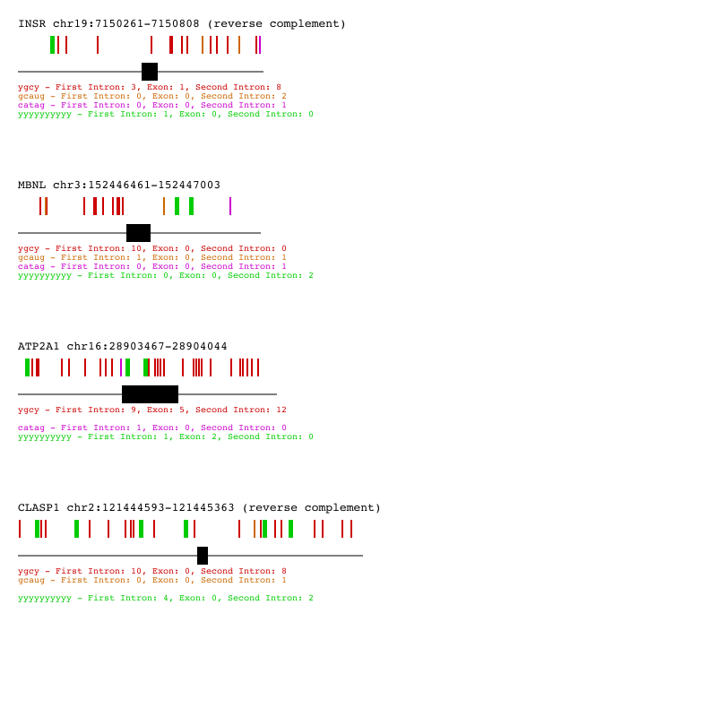

# motif-mark

Motif mark takes an inputted FASTA file (with an exon in uppercase and two flanking introns in lowercase) and annotates where specific motifs are on that sequence. 

| Flag | Argument  | Description                                                  |
| ---- | --------- | ------------------------------------------------------------ |
| -m   | --motifs  | Motif txt file. Max of 10 motifs must be separated with a space or newline. Default: motifs.txt |
| -f   | --fasta   | Fasta file with one exon per entry. Exon must be in uppercase, intron in lowercase. Default: INSR.fasta |
| -s   | --scaling | Sets scaling factor. Image can handle 780 nucleotides when scaling is one. Default scaling: 3. |
| -o   | --output  | Name of outputted SVG file. Default: output.svg              |

Given the two figure files (Fig_1_motifs.txt and Figure_1.fasta), the expected output is: 

